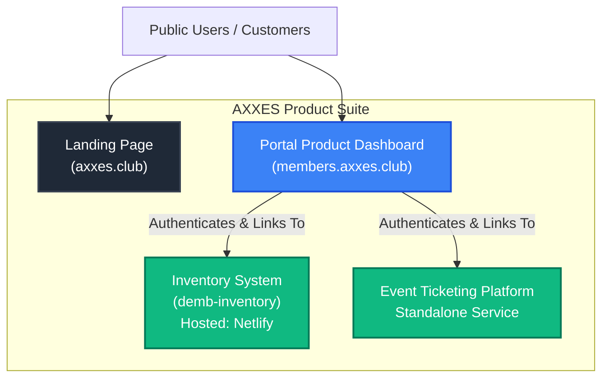

# AXXES Ecosystem Architecture

## 🏢 The Parent Company
**AXXES** is the parent SaaS company. We provide a suite of tools for the nightlife and entertainment industry, serving promoters, venues, agencies, and brands. 

Rather than a single monolithic application, the AXXES platform is composed of several specialized products. Users authenticate through a central portal and then access the various tools they subscribe to.

## 🗺 Ecosystem Map

## 🧩 Component Breakdown

### 1. Landing Page (`axxes.club`)
The primary marketing and informational site for AXXES. It drives user acquisition and funnels interested users to the Portal Product Dashboard for registration and login.

### 2. Portal Product Dashboard (`members.axxes.club`)
*This repository.*
- **Role**: The central hub for AXXES subscribers.
- **Functionality**: Handles authentication, user management, CRM, basic event tracking, and billing. It acts as the "launcher" or "portal" from which users access deeper tools.
- **Stack**: Next.js 16 (App Router), Drizzle ORM, Neon PostgreSQL, Better Auth, Tailwind CSS, Radix UI.
- **Hosting**: Vercel.

### 3. Inventory System (`demb-inventory`)
- **Role**: Specialized enterprise-grade inventory management.
- **Functionality**: Managing stock, supply chains, manufacturing processes (BOMs, build orders), and multi-channel fulfillment. 
- **Hosting**: Netlify.
- **Integration**: Accessed directly from the `members.axxes.club` sidebar dashboard. Though hosted independently, it operates strictly under the AXXES umbrella for subscribed users.

### 4. Event Ticketing Platform
- **Role**: Native ticketing system for event management.
- **Functionality**: Handling capacities, venue amenities, and multi-venue bookings.

## 🔐 Authentication Flow
Users create their AXXES accounts and log in primarily through the **Portal Product Dashboard**. From there, they utilize SSO (Single Sign-On) or shared session architecture to seamlessly transition into external products like `demb-inventory` or the Event Ticketing Platform.
